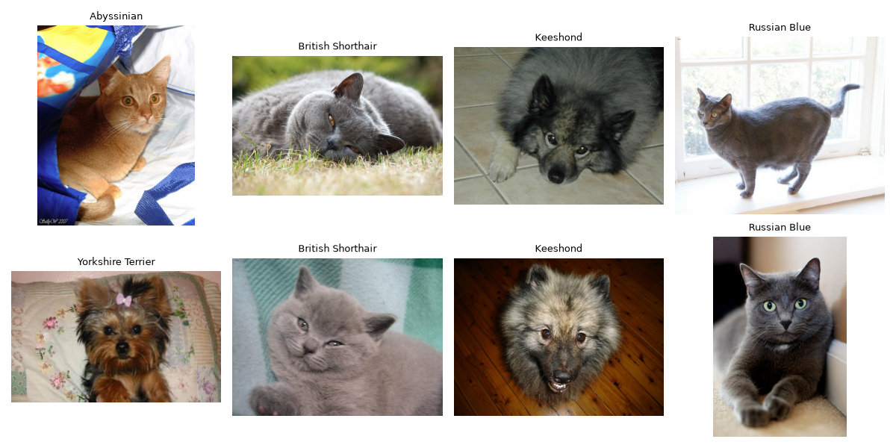
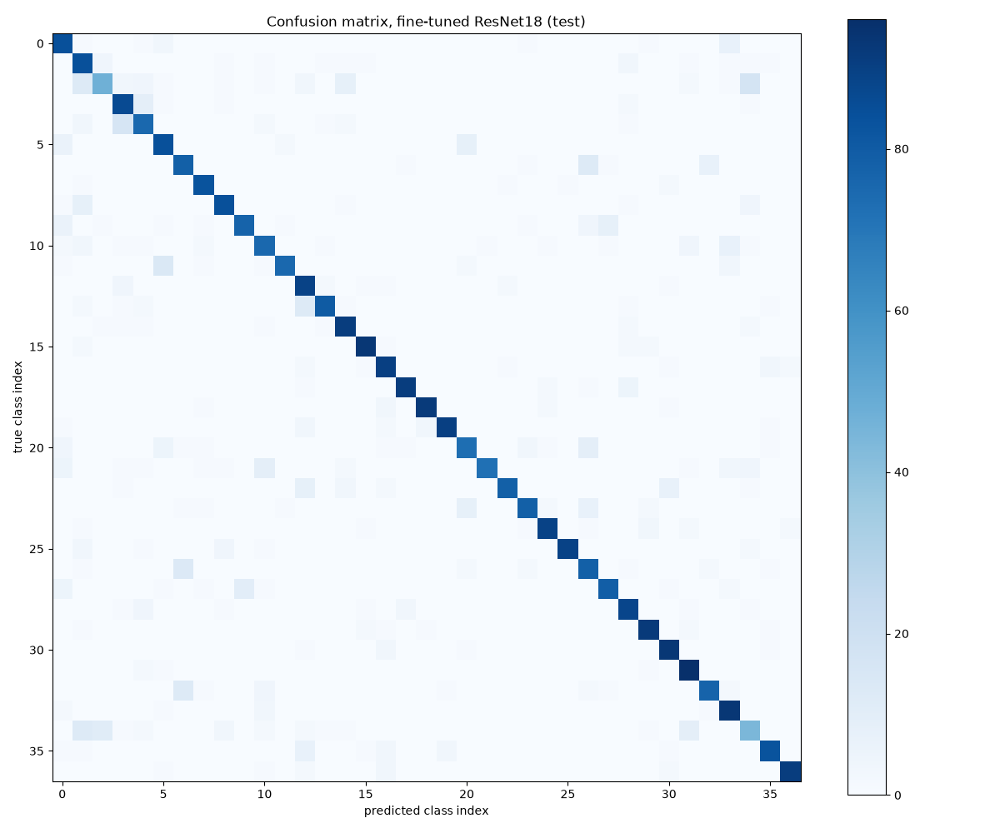
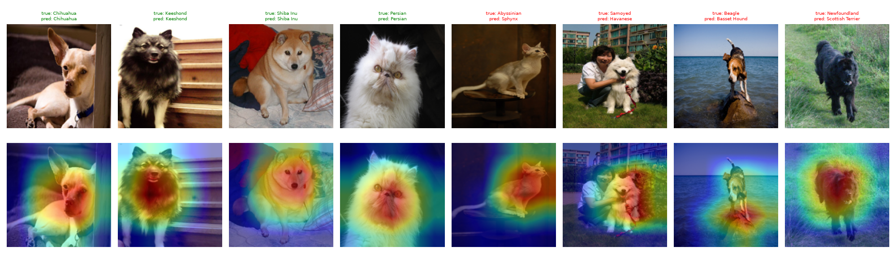

# Pet Breed Classifier: Transfer Learning vs Training from Scratch

Classifying 37 cat and dog breeds from the Oxford-IIIT Pet dataset, comparing a small CNN trained from scratch with a pretrained ResNet18 (frozen and fine-tuned).

## Summary

- **Problem:** 37-class breed classification. About 100 images per breed, so classes are nearly balanced and accuracy is a fair metric.

- **Main result:** Pretrained ResNet18 reached about 81 to 84% test accuracy (frozen mean 84.2%, fine-tuned mean 81.6%, 3 seeds each). The small CNN trained from scratch reached 19.1%. Pretraining is by far the largest effect.

- **Fine-tuning did not beat the frozen backbone.** Over 3 fine-tuning seeds, test accuracy was 80.7 to 82.9% (mean 81.6%), and all three runs were below all three frozen-backbone seeds (83.9 to 84.6%, mean 84.2%). The seed 42 run in the table is the best of the three.

- **Main limit:** look-alike breeds. American Pit Bull Terrier (47.0%) and Staffordshire Bull Terrier (49.4%) are far below the overall accuracy.

- **Scope:** CPU-only training, 160x160 images, short training runs. This is a small-budget study, not a tuned system.

## Data and splits

- Train: 2,944 images. Validation: 736 images (stratified 80/20 split of the official trainval set, seed 42). Test: 3,669 images (official test split), evaluated once at the end.

- All tuning and checkpoint selection used validation only.

## Results (test set)

| Model | Test accuracy | 95% bootstrap interval |
|---|---|---|
| Small CNN, from scratch (12 epochs) | 19.1% | 17.8 to 20.4 |
| ResNet18, frozen backbone (original run) | 84.1% | 82.9 to 85.2 |
| ResNet18, fine-tuned (5 epochs, seed 42, best of 3 seeds) | 82.9% | 81.6 to 84.1 |

Fine-tuned minus frozen: -1.2 points, 95% paired bootstrap interval -2.4 to -0.0.

Fine-tuning repeated with 3 seeds (42, 1, 2): test accuracy 82.9%, 80.7%, 81.2%, mean 81.6%, standard deviation about 1.15 points. The bootstrap intervals above measure test-set sampling noise only, not seed-to-seed variation. The frozen backbone was repeated with 3 seeds (42, 1, 2) on cached features: test accuracy 84.6%, 84.2%, 83.9%, mean 84.2%, standard deviation about 0.34 points. The table row shows the original frozen run (84.1%), whose random state differs from the seeded reruns; I did not trace the 0.5-point difference from the seed 42 rerun. The worst frozen seed beat the best fine-tuned seed, but 3 runs each is a small sample. The small CNN has one seed.

Validation accuracy for reference: small CNN 22.7%, frozen 86.7%, fine-tuned 87.6%. Each is the best epoch chosen on validation, so it is slightly optimistic. On validation fine-tuning looked ahead; on test it did not.

## Error analysis (fine-tuned model, test set)

- Hardest breeds: American Pit Bull Terrier 47.0%, Staffordshire Bull Terrier 49.4%, Miniature Pinscher 72.0%, Maine Coon 73.0%, Beagle 75.0%.

- Easiest breeds: Shiba Inu 96.0%, Bombay 94.3%, Scottish Terrier 93.9%.

- Most common mistakes (true -> predicted): Pit Bull -> Staffordshire (17), Beagle -> Basset Hound (16), Egyptian Mau -> Bengal (14), Ragdoll -> Birman (13), Birman -> Ragdoll (12).

- The errors are mostly visually similar breeds, not random. I did not test why (resolution, pose, background or label noise).

- Each breed has only about 100 test images, so per-breed accuracies carry a margin of several points.

## Grad-CAM

Heatmaps are in gradcam.png; I have not analyzed them systematically. Grad-CAM from ResNet18's last layer on 160x160 input gives a coarse 5x5 map, and 8 random images are too few to draw conclusions.

## Demo

`python app.py` starts a Gradio app (top-3 breeds for an uploaded photo). The model has no "not a pet" option, so any image gets one of the 37 breeds. In one informal test with a photo I uploaded myself, the top-1 prediction was wrong. I did not test the demo systematically.

## Run it yourself

1. `python -m venv .venv`, then `.venv\Scripts\activate` (Windows), then `pip install -r requirements.txt`

2. `python -m src.download_data` (about 800 MB)

3. `python -m src.data` (creates splits.json)

4. `python -m src.small_cnn`, `python -m src.resnet_frozen`, `python -m src.resnet_finetune`

5. `python -m src.final_eval`, `python -m src.analyze`, `python -m src.gradcam`

6. `python app.py`

Model files (.pt) and the dataset are not in Git. Training on a CPU takes about 30 minutes for the small CNN and about 16 minutes for fine-tuning. A fresh-environment install of requirements.txt was tested on Windows with Python 3.12 only. Not tested on Linux or macOS.

## What I did not test

- The fine-tuned and frozen models were run with 3 seeds each, which is still few. The small CNN has one seed, so its run-to-run variance is unknown. Differences of a point or two should not be trusted.

- The small CNN was still improving at epoch 12, so 19.1% understates what it could reach with more training.

- No tuning of learning rates, schedules, image size or augmentation for fine-tuning. The frozen model's features were extracted without augmentation.

- Why fine-tuning did not help (overfitting, learning rate, or noise) is untested.

- Larger models, higher resolution, and class-confusion fixes were not tried.

- Behavior on non-pet or out-of-distribution images was not measured.

